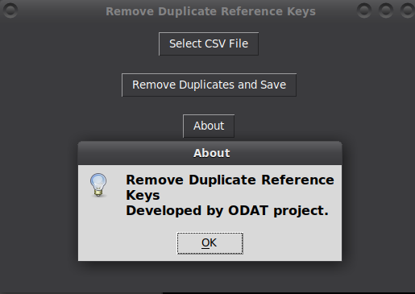

# Tool 3

This GUI application lets you open a CSV and automatically remove duplicate reference keys, and save the result as a new CSV via a simple GUI.

## Description

[Visit odat.info](https://odat.info)

## Screenshot

